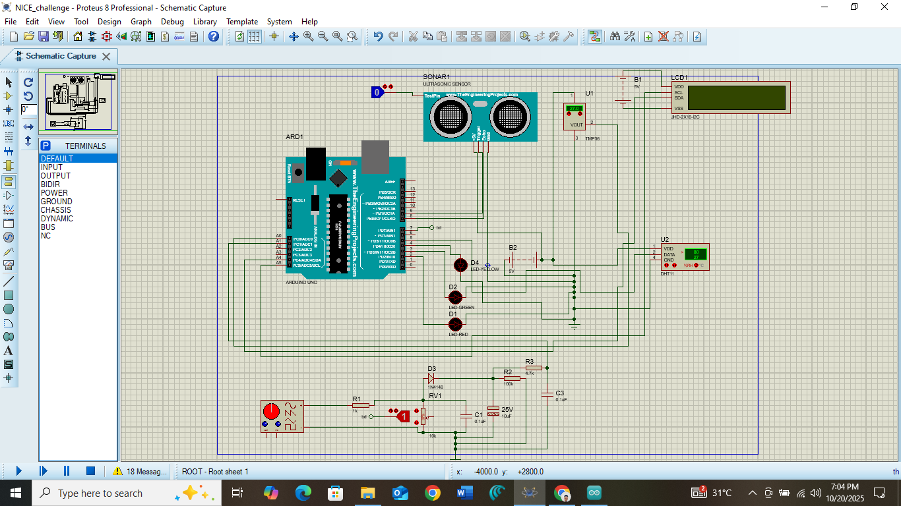

# Smart Concrete Mix Ratio Verification Sensor System (SCMRVS)

## Problem
In construction, incorrect concrete mix ratios often lead to structural failure, weak buildings, and long-term safety risks. Most quality control methods are manual, reactive, and unreliable, especially in small and medium-scale construction sites.

---

## System Overview
This project is an intelligent embedded sensing system designed to verify concrete mix quality in real time using multi-sensor fusion and edge computing principles.

The system shifts concrete quality control from manual inspection to data-driven verification using embedded AI concepts.

---

## System Architecture
- Sensing Layer: Multiple sensors capture physical and electrical properties of fresh concrete  
- Processing Layer: ESP32 processes incoming sensor data in real time  
- Intelligence Layer: Lightweight decision logic (rule-based / TinyML-ready architecture)  
- Output Layer: Pass/Fail result for mix quality + data logging system  
- Cloud Layer (future scope): Dashboard for tracking construction quality trends  

---

## Components Used
- ESP32 Microcontroller  
- Electrical impedance sensor (for water-cement ratio estimation)  
- Ultrasonic sensor (for structural density estimation)  
- Temperature sensor (for normalization)  
- Custom 2-layer PCB design (60x100 mm)  
- Power management module  
- Data logging system  

---

## My Contribution
- Co-designed system architecture for multi-sensor concrete quality verification  
- Developed embedded system logic for real-time sensor fusion  
- Designed PCB layout for hardware integration and deployment efficiency  
- Built data processing pipeline for sensor normalization and interpretation  
- Contributed to system roadmap from prototype to scalable deployment model  

---

## Results
- Demonstrated early-stage validation of automated concrete mix verification  
- Improved accuracy of mix assessment compared to manual estimation methods  
- Reduced dependency on human inspection for quality control  
- Established foundation for scalable smart construction monitoring systems  

---
## Circuit Design (PCB Layout)

Click to view full resolution:

## Demo / Evidence

Google Drive:
- https://drive.google.com/drive/folders/1f1FVR_Phpt9XQw7g5xwXvdjgHdeoBj8b?usp=drive_link  
- https://drive.google.com/drive/folders/1nFI3lLJ2K33FztLeS0u2FDPhnV2zbkIP?usp=drive_link  

GitHub:
https://github.com/elontim
