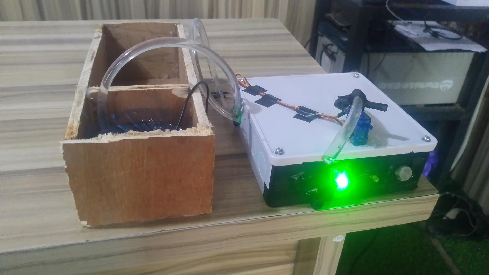

# Smart Fire Detection and Automatic Extinguishing System

## Problem
Fire incidents in homes, labs, and small facilities are often detected late, leading to property loss, injuries, and sometimes fatalities. Most available systems in low-cost environments are alarm-based only and do not actively respond to suppress fire at early stages.

---

## System Overview
This system is an embedded IoT fire safety solution that detects fire and smoke conditions in real time and triggers an automatic response system. It combines sensor data processing with actuator control to both alert users and actively reduce fire spread.

The system operates in three stages:
1. Detection using smoke and flame sensors
2. Processing and decision-making using ESP32
3. Response via alarm system and water pump activation

---

## System Architecture
- Sensor Layer: Flame sensor and MQ-2 smoke sensor continuously monitor environmental conditions
- Processing Layer: ESP32 microcontroller processes sensor signals and applies threshold logic
- Actuation Layer: Relay module activates water pump, buzzer, and LED indicators
- Communication Layer: Optional real-time alerts via Telegram or web dashboard

---

## Components Used
- ESP32 Microcontroller
- MQ-2 Smoke Sensor
- Flame Sensor
- Relay Module
- Water Pump
- Buzzer
- LED Indicators
- Breadboard and connecting wires
- Power supply unit

---

## My Contribution
- Designed the full embedded system architecture from sensing to actuation
- Developed firmware logic for real-time sensor monitoring using ESP32
- Implemented threshold-based fire detection and false alarm reduction logic
- Integrated relay control system for automatic water pump activation
- Assisted in system testing, debugging, and hardware calibration

---

## Results
- Fire and smoke detection response time reduced to a few seconds in test conditions
- Successful automatic activation of extinguishing mechanism during simulated fire scenarios
- Improved reliability through sensor fusion logic reducing false triggers
- Demonstrated proof of concept for low-cost smart fire safety systems in small environments

---

### Media

## Demo / Evidence
Google Drive Proof:
https://drive.google.com/drive/folders/1nFI3lLJ2K33FztLeS0u2FDPhnV2zbkIP?usp=drive_link

GitHub Repository:
https://github.com/elontim
