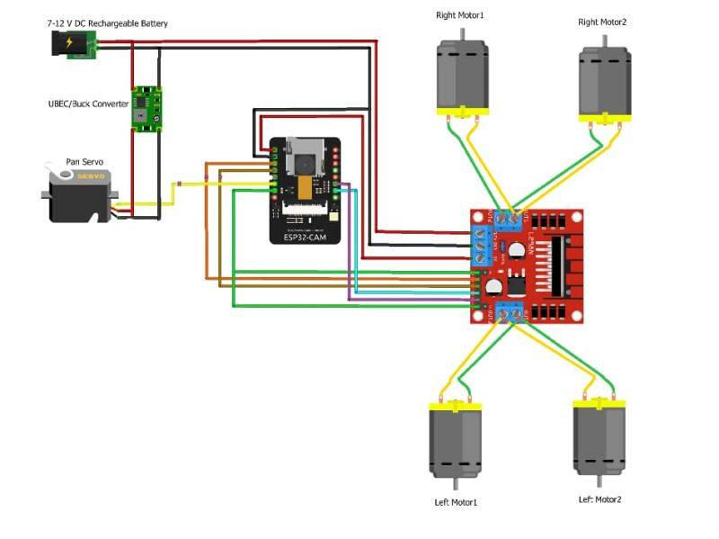

# WiFi Controlled Surveillance Car System

## Problem
Security monitoring in low-cost environments is often manual, inefficient, and lacks real-time remote visibility. This limits effective surveillance in homes, labs, and small facilities.

---

## System Overview
This project is an IoT-based surveillance robot that enables real-time remote monitoring and movement control via WiFi. It integrates embedded systems, wireless communication, and basic automation to create a mobile security prototype.

The system enables:
- Remote navigation via mobile or web interface
- Real-time environment monitoring
- Camera-based surveillance streaming (where available)

---

## System Architecture
- Input Layer: Mobile or web control commands
- Processing Layer: ESP32 microcontroller interprets commands
- Communication Layer: WiFi module enables remote connectivity
- Actuation Layer: Motor driver controls movement system
- Vision Layer: Optional camera streaming module for live feed

---

## Components Used
- ESP32 Microcontroller
- Motor Driver Module (L298N)
- DC Motors
- Chassis (robot frame)
- WiFi communication module (ESP32 built-in)
- Battery pack
- (Optional) Camera module for streaming

---

## My Contribution
- Designed system architecture for wireless surveillance mobility
- Implemented ESP32 firmware for motor control and WiFi command handling
- Integrated hardware components for movement and control system
- Assisted in testing navigation responsiveness and stability
- Optimized control logic for smoother directional response

---

## Results
- Achieved real-time wireless control of robotic movement
- Successfully demonstrated remote navigation over WiFi network
- Improved responsiveness and stability through control tuning
- Validated feasibility of low-cost surveillance robotics system

---

## Images / Hardware Evidence

### Robot Prototype

### System Build

### Circuit / Setup View

---

## Demo / Evidence
- Google Drive: https://drive.google.com/drive/folders/1A9FG91WRtUFslWnGvLtJzfoMbRE1iYOy?usp=drive_link
- Full Evidence Folder: https://drive.google.com/drive/folders/1nFI3lLJ2K33FztLeS0u2FDPhnV2zbkIP?usp=drive_link
- GitHub: https://github.com/elontim
